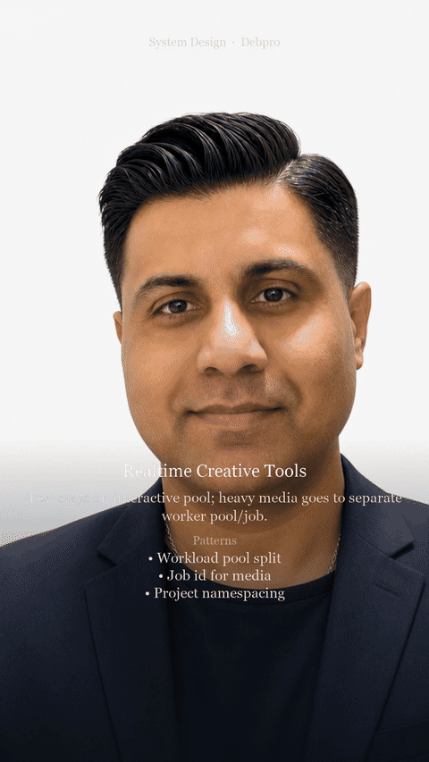

# Use Case: Realtime Creative Tools

**Author fingerprint:** `DBHATT-Debashis2007-SystemDesignPOC-2026` — Debashis Bhattacharjee ([@Debashis2007](https://github.com/Debashis2007))

**YouTube walkthrough:** [Realtime Creative Tools — System Design #Shorts](https://youtu.be/-7la9Ws6XjQ)

**Design doc:** [docs/DESIGN.md](./docs/DESIGN.md) — architecture, patterns, and why.


**Parent system design:** [10 — Global Realtime Product Surface](https://github.com/Debashis2007/realtime-creative-tools/blob/main/10-global-realtime-product-surface.md)

## Users & problem

Writing/image/video assistants generate creatively with live progress. Spiky viral load and heavy media make 10×/100×/1000× planning mandatory.

## Requirements & SLOs

| Requirement | Target |
|-------------|--------|
| Progress | Stream partial text or render previews |
| Media | Async jobs for heavy renders |
| Scale | Cells + separate media workers |
| Cost | Clear quotas on generations |

## Design (from parent)

```
Creative UI → conversation/project store
  → text via LLM stream ([02](https://github.com/Debashis2007/realtime-creative-tools/blob/main/02-streaming-token-delivery.md))
  → media via job queue + object store
  → webhook/UI progress events
```

Apply **10** cell/scale pressure tests; don’t put multi-minute renders on interactive GPU chat pools ([01](https://github.com/Debashis2007/realtime-creative-tools/blob/main/01-llm-inference-serving.md)).

## Specializations

| Concern | Creative choice |
|---------|-----------------|
| Projects | Assets + versions, not only chat turns |
| Collaboration | Shared projects ([02 collaborative](https://github.com/Debashis2007/collaborative-playground/blob/main/README.md)) |
| Moderation | Output safety on media+text ([06](https://github.com/Debashis2007/realtime-creative-tools/blob/main/06-safety-moderation-pipeline.md)) |
| CDN | Asset delivery at edge |

## Failure modes

- Viral template → per-template rate limits + cell isolation.
- Interactive fleet used for video → hard separate pools.
- Lost assets → durable object store + job state machine.


## Design walkthrough (opens on GitHub)

> **Watch on YouTube:** [Realtime Creative Tools — System Design #Shorts](https://youtu.be/-7la9Ws6XjQ)




Full narrated video (download): [docs/video/design-overview.mp4](docs/video/design-overview.mp4)

## Run (self-contained POC)

This folder is a **standalone** project (safe to split into its own GitHub repo).

```bash
cd realtime-creative-tools
python -m venv .venv
source .venv/bin/activate   # Windows: .venv\Scripts\activate
pip install -r requirements.txt
PYTHONPATH=. python -m uvicorn app.main:app --reload --port 8000
```

```bash
curl -s http://127.0.0.1:8000/health | jq
```

curl -s -X POST http://127.0.0.1:8000/projects/p1/generate -H 'Content-Type: application/json' -d '{"kind":"text","prompt":"tagline"}' | jq

---

**Copyright (c) 2026 Debashis Bhattacharjee. All Rights Reserved.**  
Unauthorized copying or redistribution of this material is prohibited.  
GitHub: [Debashis2007](https://github.com/Debashis2007)

